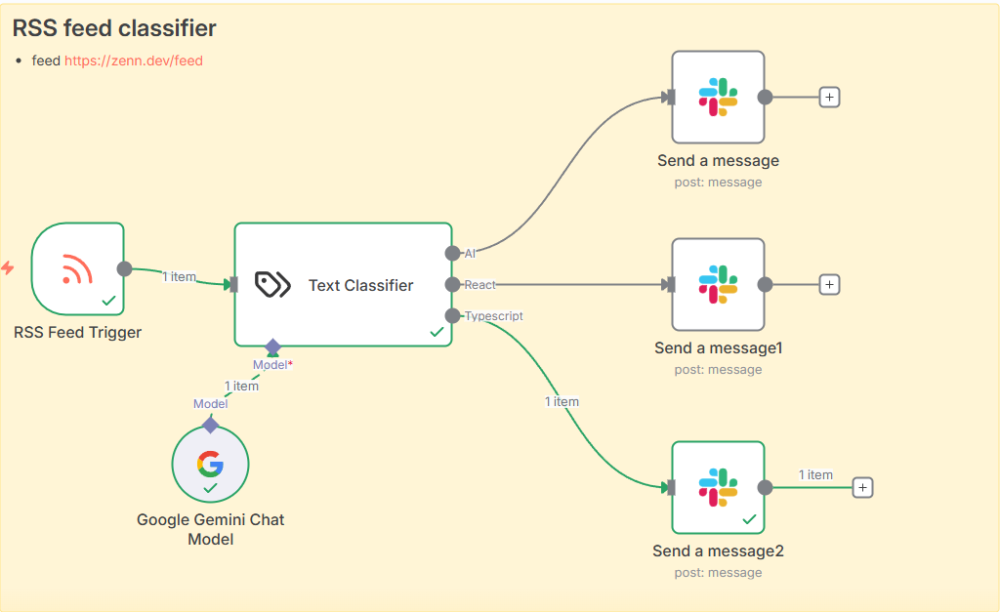

# Day 8 - RSS Feed Classifier

Created an automated workflow that classifies RSS feed items and routes them to appropriate Slack channels based on content.

## Features

- Monitors Zenn.dev RSS feed for new articles
- Uses Google Gemini to classify articles into categories (AI, React, TypeScript)
- Routes articles to dedicated Slack channels based on classification
- Runs automatically on a schedule (every minute)
- Supports Japanese content from Zenn.dev

## Workflow

## Slack Notification

## Workflow JSON

See [RSS feed classifier.json](./RSS%20feed%20classifier.json) for the workflow configuration.
