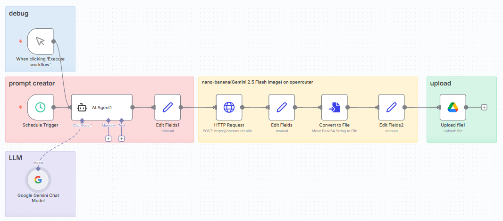

# Day 10 - Automated Document Processing with Google Drive and AI

This workflow generates images using Google's Gemini 2.5 Flash (Nano Banana) model by processing text prompts from Google Drive and saving the generated images back to a specified folder.

## Features

- Monitors a Google Drive folder for new text prompts
- Uses Gemini 2.5 Flash (Nano Banana) for high-quality image generation
- Supports custom image generation parameters
- Automatically saves generated images to Google Drive
- Sends Slack notifications when new images are generated (optional)
- Includes error handling and retry logic for reliability

## Prerequisites

- Google Cloud Platform service account with Drive API access
- Google Gemini API key with access to Gemini 2.5 Flash (Nano Banana)
- Slack webhook URL (optional, for notifications)

## Setup Instructions

1. Set up Google Drive API access:

   - Create a service account and download the credentials.json file
   - Share your target Google Drive folders with the service account email

2. Configure environment variables:
   - `GOOGLE_APPLICATION_CREDENTIALS`: Path to your service account key file
   - `GEMINI_API_KEY`: Your Google Gemini API key
   - `GOOGLE_DRIVE_OUTPUT_FOLDER_ID`: ID of the folder to store generated images
   - `SLACK_WEBHOOK_URL`: (Optional) For receiving notifications

## Workflow Overview

1. **Schedule Trigger**: Checks for new text files in the specified interval
2. **Google Drive Node**: Scans the input folder for new prompt files
3. **Filter Node**: Identifies unprocessed text files
4. **Google Drive Node**: Downloads the prompt file content
5. **Gemini 2.5 Flash Node**: Generates image based on the prompt
6. **Google Drive Node**: Saves the generated image to the output folder
7. **Slack Node**: (Optional) Sends a notification when image is generated

## Example Output

## Customization Options

- Adjust image generation parameters (size, style, etc.) in the Gemini node
- Modify the file naming convention for generated images
- Add additional processing steps before or after image generation

## Troubleshooting

- Check API key permissions for both Gemini and Google Drive
- Verify the service account has read/write access to both input and output folders
- Review execution logs for specific error messages
- Ensure prompt files are properly formatted as plain text

## Next Steps

- Add support for batch processing multiple prompts
- Implement different image generation styles
- Create a web interface for submitting prompts
- Add image post-processing options (resizing, filtering, etc.)

## Video Demo

<video src="./demo.mp4" controls width="100%"></video>
