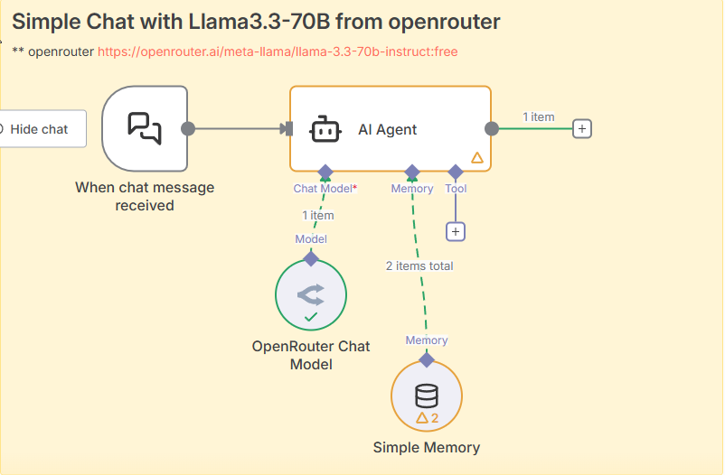

# Day 11 - Llama3.3-70B via OpenRouter API

This workflow demonstrates how to use the powerful Llama3.3-70B language model through the OpenRouter API for natural language processing tasks.

## Key Features

- Integration with Llama3.3-70B model via OpenRouter API
- Simple and efficient API calls with customizable parameters
- Example implementation for text generation
- Easy to modify for various NLP tasks

## Prerequisites

- OpenRouter API key
- n8n set up with HTTP Request node
- Basic understanding of API requests

## Workflow



## Configuration

1. Set up your OpenRouter API key in the HTTP Request node
2. Configure the model parameters (temperature, max_tokens, etc.)
3. Customize the prompt according to your needs

## Example Usage

```json
{
  "model": "meta-llama/llama-3-70b-instruct",
  "messages": [
    {
      "role": "user",
      "content": "Your prompt here"
    }
  ]
}
```

## Workflow JSON

See [Llama3OpenRouter.json](./Llama3OpenRouter.json) for the complete workflow configuration.
