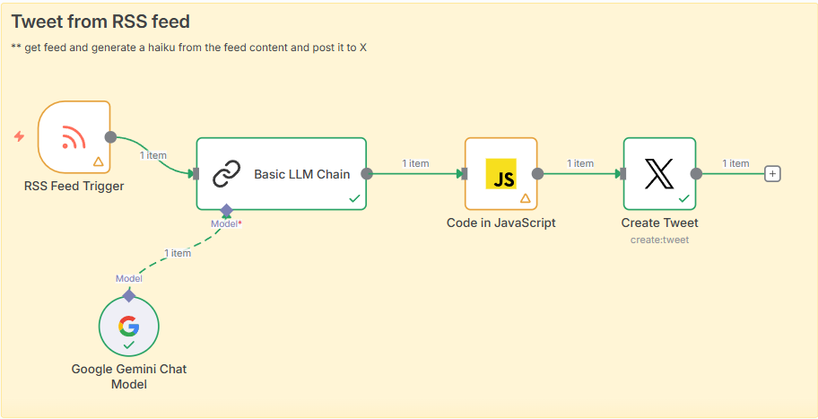

# Day 13: RSS Feed to Haiku Generator

This workflow automates the process of reading an RSS feed, generating a haiku using Gemini, and posting it to X (Twitter).

## Workflow Steps

1. **Read Feed**: Fetches the latest entries from an RSS feed.
2. **Parse Content**: Extracts the title and content from the feed items.
3. **Generate Haiku**: Uses Gemini Flash 2.5 to generate a haiku based on the title and content.
4. **Format Data**: JavaScript code creates a structured object from the Gemini output.
5. **Post to X**: Posts the formatted haiku to X.

## workflow

## X Account

Check out the generated haikus here: [https://x.com/haiku_haku](https://x.com/haiku_haku)
