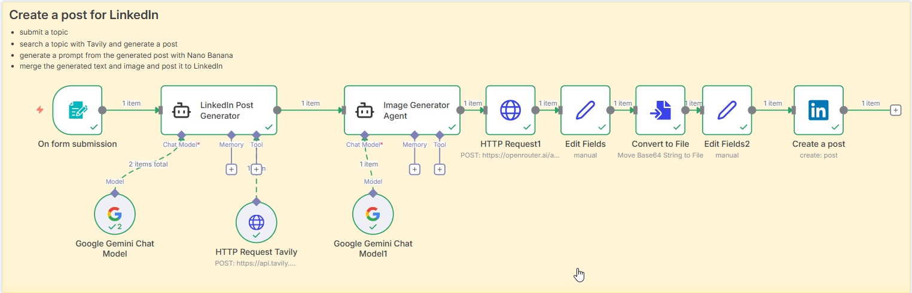

# Day 14: Automated LinkedIn Post Generator

This workflow automates the creation and posting of LinkedIn content using AI tools.

## Workflow Steps

1. **Receive Input**: Accepts a topic and target audience.
2. **Generate Post**: Uses Gemini and Tavily API to research and generate a LinkedIn post tailored to the audience.
3. **Generate Image Prompt**: Uses the gemini-2.5-flash-image model via the OpenRouter API to create an image generation prompt based on the generated post.
4. **Merge Content**: Combines the generated text and image.
5. **Post to LinkedIn**: Publishes the final content to LinkedIn.

## Workflow

## Output

