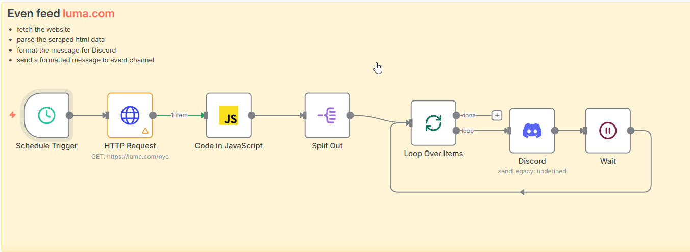
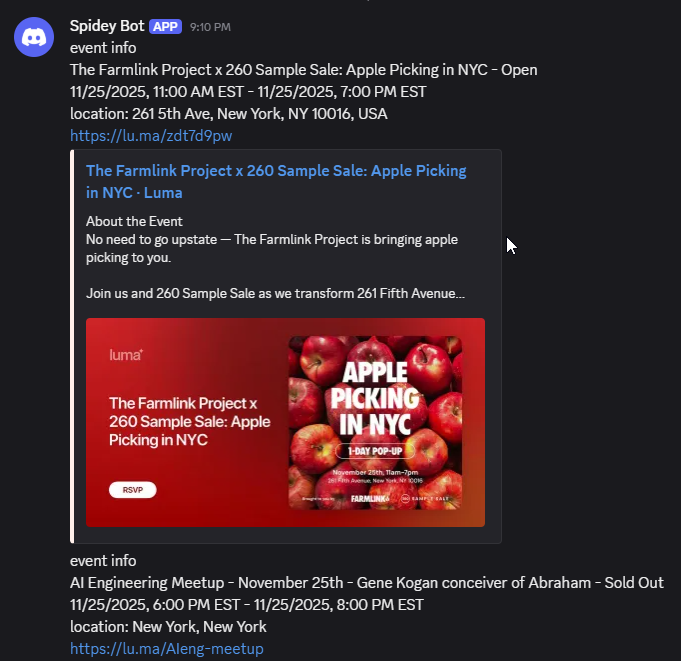

# Day 15: Event Notification Workflow

This workflow scrapes event data from Luma and sends notifications to Discord.

## Workflow Steps

1. **Fetch HTML**: Retrieves the HTML content from [https://luma.com/nyc](https://luma.com/nyc).
2. **Parse HTML**: Uses JavaScript to parse the HTML and extract event details.
3. **Split Output**: Splits the array of events into individual items for processing.
4. **Send to Discord**: Iterates through each event and sends a message to a Discord channel.
5. **Rate Limiting**: Waits for 5 seconds after each message to avoid hitting Discord's rate limits.

## Workflow

## Output

