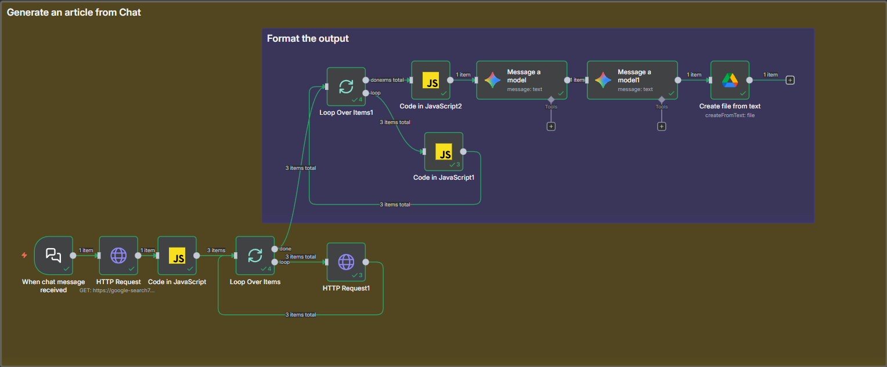
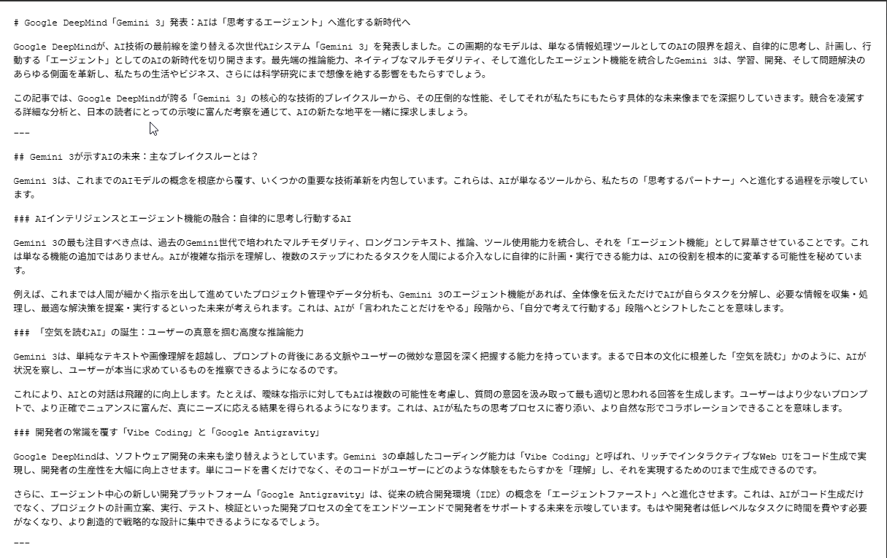

# Day 16: Generate Article from Chat

An n8n workflow that converts chat messages into formatted articles using AI models and Google Drive.

## Overview

This workflow listens for chat messages, processes them through AI models to generate article content, formats the output, and saves the result to Google Drive.

## Workflow Components

### Main Flow

1. **When chat message received** — Webhook trigger that receives chat messages
2. **HTTP Request** — Fetches additional data or context
3. **Code in JavaScript** — Processes and transforms the input data
4. **Loop Over Items** — Iterates through multiple items if needed

### Article Generation (Subflow)

5. **Loop Over Items1** — Processes each item for article generation
6. **Code in JavaScript2** — Prepares data for AI processing
7. **Message a model** — First AI model call for content generation
8. **Code in JavaScript1** — Intermediate processing
9. **Message a model1** — Second AI model call for refinement
10. **Create file from text** — Saves the generated article to Google Drive

### Output Formatting

11. **Format the output** — Structures the final response
12. **HTTP Request1** — Sends the formatted response back

## Key Features

- **Chat-triggered workflow** — Responds to incoming chat messages
- **Dual AI processing** — Uses two AI model calls for better content quality
- **JavaScript customization** — Multiple code nodes for flexible data transformation
- **Google Drive integration** — Automatically saves generated articles
- **Loop processing** — Handles multiple items in a single workflow run

## Use Cases

- Generate blog posts from conversation topics
- Create documentation from chat discussions
- Transform meeting notes into formatted articles
- Automate content creation from user requests

## Example Output

## Setup Requirements

- n8n instance (local or cloud)
- AI model credentials (e.g., OpenAI, Anthropic, or Google Gemini)
- Google Drive API access
- Webhook endpoint configuration

## Notes

This workflow demonstrates advanced n8n patterns including nested loops, multiple AI model calls, and integration between chat interfaces and document storage systems.
