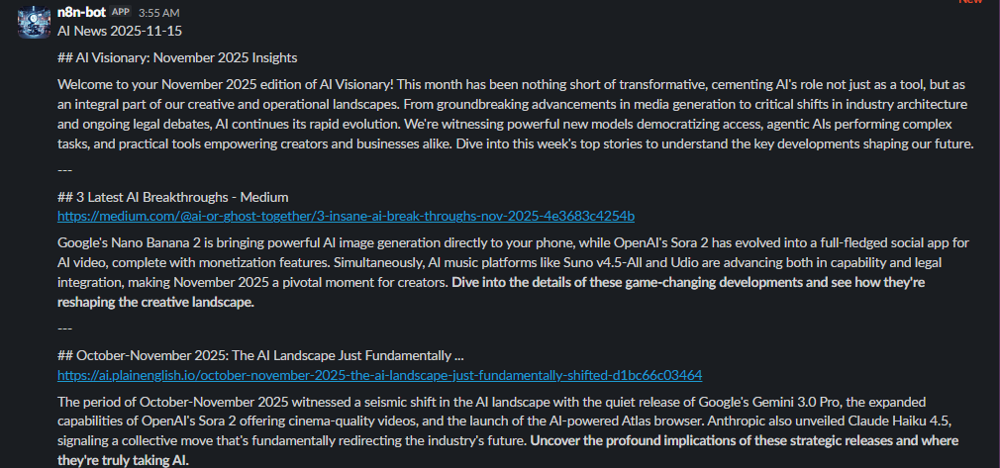

# Day 9 - RSS Feed Classifier with Slack Notifications

Enhanced the RSS Feed Classifier with detailed Slack notifications and improved content handling.

## New Features

- Added rich Slack message formatting with article previews
- Implemented error handling for failed API calls
- Added article summarization for better previews
- Included article tags in Slack notifications
- Added timestamp of when the article was published

## Workflow

## Slack Notification Example

## Workflow JSON

See [AINewsletter.json](./AINewsletter.json) for the updated workflow configuration.
